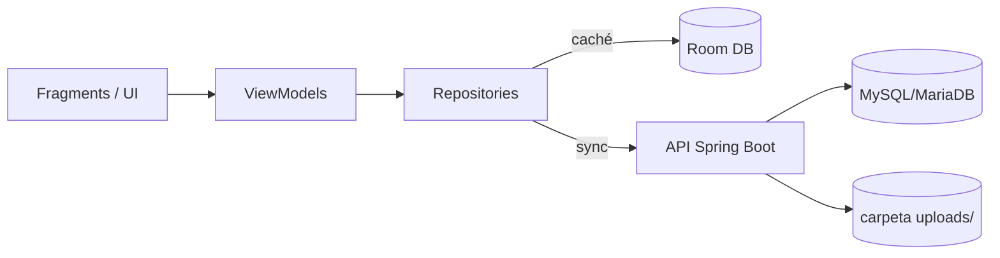

<div align="center">

# CollectHub

**Gestor de colecciones Android + API Spring Boot (JWT)**

Offline-first: caché local con Room + persistencia remota con MySQL/MariaDB.


</div>

---

## Índice
1. [Qué puedes hacer](#qué-puedes-hacer)
2. [Quickstart (local)](#quickstart-local)
3. [Arquitectura](#arquitectura)
4. [Estructura del proyecto (Android)](#estructura-del-proyecto-android)
5. [Resumen de la API](#resumen-de-la-api)
6. [Troubleshooting](#troubleshooting)

---

## Qué puedes hacer
| Área | Incluye |
|---|---|
| Colecciones | Imagen, color, descripción, contadores, papelera + borrado definitivo |
| Ítems | CRUD, valoración, estado, categoría, tags, favoritos, imágenes (galería/cámara), papelera + borrado definitivo |
| Lista de deseos | CRUD + papelera + borrado definitivo |
| Préstamos | Prestados/recibidos, vencimientos, devuelto, notas, notificaciones |
| Logros | Desbloqueo + persistencia por usuario |
| Perfil | Avatar, nombre visible y bio (guardado en backend) |
| Temas | Selector de paleta + modo |
| Widget | Resumen con contadores |

---

## Quickstart (local)

### 1) Backend (Spring Boot)
Ruta: `Api_Colecciones/ApiColecciones`

1. Arranca MySQL/MariaDB.
2. Revisa `src/main/resources/application.properties` (db url/user/pass, puerto, dir de subidas).
3. Ejecuta la aplicación Spring Boot desde tu IDE.

Por defecto:
- API: `http://localhost:8080`
- Directorio de subidas: `uploads/`
- Hibernate: `spring.jpa.hibernate.ddl-auto=update`

### 2) Android (emulador)
Ruta: `Gestor_Colecciones`

1. Abre el proyecto en Android Studio.
2. Ejecuta en un emulador.

Importante:
- Desde el emulador, usa `http://10.0.2.2:8080` para llegar al `localhost:8080` del PC.

Config Android (según `app/build.gradle.kts`):
- `minSdk = 24`
- `targetSdk = 36`
- Java/Kotlin target: `11`

---

## Arquitectura

### Flujo de datos (offline-first)


### Autenticación
- JWT guardado en local y enviado como `Authorization: Bearer <token>`.

---

## Estructura del proyecto (Android)
```text
app/src/main/java/com/example/gestor_colecciones/
|-- activities/      # Activities (host)
|-- adapters/        # RecyclerView adapters
|-- auth/            # AuthStore + auth repo/viewmodels
|-- dao/             # Room DAOs
|-- database/        # DatabaseProvider + migrations
|-- entities/        # Room entities
|-- fragment/        # Screens: Collections, Items, Wishlist, Loans, Profile, Trash...
|-- model/           # UI models/state
|-- network/         # ApiService, ApiProvider, DTOs, uploads helpers
|-- repository/      # Data access + sync/trash/loans logic
|-- util/            # Themes, image helpers, misc
`-- viewmodel/       # ViewModels + factories
```

---

## Resumen de la API
> Mapa rápido de los endpoints más importantes usados por la app.

| Área | Endpoints |
|---|---|
| Auth | `POST /api/auth/register`, `POST /api/auth/login`, `POST /api/auth/login-strict` |
| Perfil | `GET /api/usuarios/me`, `PUT /api/usuarios/me` |
| Uploads | `POST /api/uploads` |
| Colecciones | CRUD + papelera + hard delete |
| Ítems | CRUD + tags + papelera + hard delete |
| Deseos | CRUD + papelera + hard delete |
| Préstamos | `POST /api/prestamos`, `PUT /api/prestamos/{id}/devolver`, `GET /api/prestamos/prestados`, `GET /api/prestamos/recibidos`, `DELETE /api/prestamos/{id}/hard` |

---

## Troubleshooting

<details>
<summary><b>El emulador no conecta con el backend</b></summary>

- Usa `10.0.2.2` (no `localhost`) desde el emulador.
- Comprueba que el backend está levantado y el puerto es correcto.
</details>

<details>
<summary><b>HTTP 400</b></summary>

- Revisa el error exacto en Logcat (Android) y en los logs de Spring Boot.
</details>

<details>
<summary><b>Las imágenes no se ven</b></summary>

- Asegúrate de que el backend sirve `/uploads/**` y existe la carpeta `uploads/`.
- Verifica que la app recibe rutas tipo `/uploads/<uuid>.jpg`.
</details>

<details>
<summary><b>Permisos de cámara</b></summary>

- Asegura que la app tiene concedido `android.permission.CAMERA` en dispositivo/emulador.
</details>

---

## Capturas (opcional)
Si quieres que el README sea aún más visual, añade imágenes en `docs/screenshots/` y enlázalas aquí.

